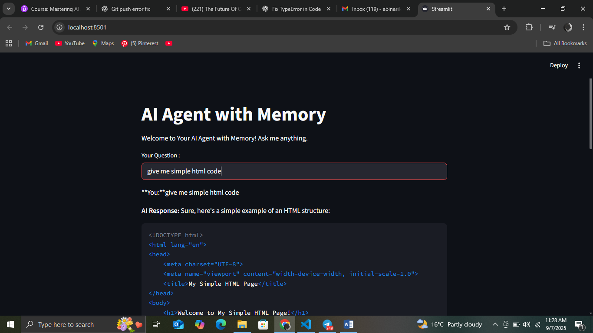

# 🤖 Basic AI Agent with Ollama

This project demonstrates how to build a **basic AI agent** powered by [Ollama](https://ollama.ai) using the **Mistral model**.  
The goal is to experiment with LLMs locally, test prompt-based interactions, and set up a foundation for building more advanced AI agents.

---

## 📌 Features
- Runs locally using **Ollama** (no external API needed)  
- Uses the **Mistral model** for reasoning and text generation  
- Basic agent that can:  
  - Answer questions  
  - Follow instructions  
  - Provide reasoning for simple tasks  
- Extensible for future use cases like tools, APIs, and multi-agent systems

---

## 🛠️ Installation & Setup

### 1. Install Ollama
Download Ollama from [here](https://ollama.ai/download).  
Make sure it’s running in the background:


### 2. Pull the Mistral Model
```bash
ollama pull mistral
```

### 3. Clone this project
```bash
git clone https://github.com/your-username/basic-ai-agent.git
cd basic-ai-agent
```

### 4. Run the AI Agent

```bash
python basic_ai_agent.py
```

### 📂Project Structure
```bash
basic-ai-agent/
│── main.py          # Entry point for the agent
│── agent.py         # Core agent logic
│── prompts/         # Example prompts for testing
│── README.md        # Project documentation
```
